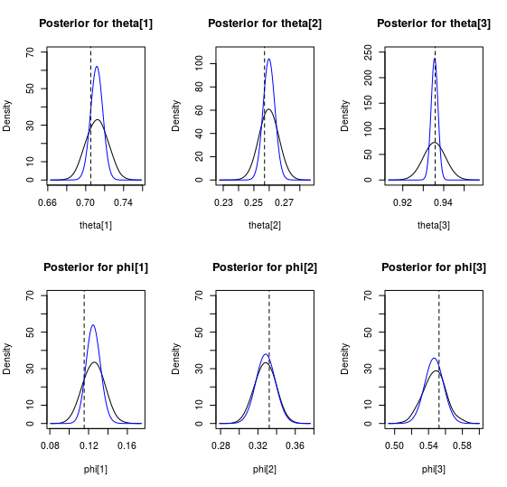

# Variational Bayesian Inference

It's well known that computing the posterior distribution of model parameters is
usually analitically intractable. Many tools have been developed to approximate the
posterior distribution, like Markov Chain Monte Carlo (MCMC). More recently, variational
methods have been developed to approximate the posterior distribution of bayesian models.

Variational methods posit a family of variational distributions that is more tractable
than the joint or posterior distribution of parameters. Then, an optimal solution is found
by optimizing a functional that computes the divergence between the variational distribution
and the posterion. Most bayesian varitional methods use the Kullback-Leibler divergence as
the discrepancy measure.

But computing the Kullback-Leibler divergence is also intractable in most models because it requires
the computation of Baye's formula denominator. So, a similar measure is used: the Evidence Lower Bound,
or ELBO, which is proportional to the negative Kullback-Leibler divergence up to an additive constant.
This means that maximizing this lower bound is the same as minimizing the Kullback-Leibler divercenge,
and thus the variational solution is the one that minimizes the information loss.

# Mixture models

Mixture models are a flexible representation for data that do not follow a common parametric
distribution. A (finite) mixture model represents the data as a set of random draws from 
multiple distributions of simple parametric form. Each simple distribution is sampled
according to its *mixture* parameter.

# Mixture of binomials

This repository implements a simple variational algorithm to fit a mixture of binomials model
to a vector of observed successes and a known number of total trials. The model is heavily based
on Bishop's *Pattern Recognition and Machine Learning*, specially the section 10.2 where he
derives the variational algorithm to fit a mixture of Gaussians.

The proposed mixture model can be easily understood from a data-generation perspective. Assuming
that the total number of trials for each observation, $N_t$, is known; and given
the hyperprior parameters $\alpha$, $\beta$ and $\eta$:

1. Draw a mixture proportion $\phi$ from a symmetric Dirichlet prior: $\phi \sim \mathrm{Dir_K}(\eta)$;
2. For each mixture component $k \in \{1 \ldots K\}$:
  + Draw a binomial parameter $\theta_k$ from a Beta prior: $\theta_k \sim \mathrm{Beta}(\alpha, \beta)$
3. For each datapoint $n \in \{1\ldots N\}$:
  + Draw an indicator variable $z_n$ from a categorical distribution: $z_n \sim \mathrm{Cat_K}(\phi)$
  + Draw the observed number of successes $y_n$ from a binomial distribution: $y_n \sim \mathrm{Binomial}(\theta_{z_n}, N_t)$

# Gibbs sampler

A simple and non-optimized Gibbs sampler is also provided for the same model.
Its purpose is to compute the posterior for the same dataset using a different
approximation strategy, so that results can be compared.

# Comparison between approximations

<<<<<<< HEAD

The posterior distribution for the main parameters are shown in the plot above.
The black curve is the density estimation based on the posterior samples obtained with
the Gibbs algorithm. In blue, the approximation based on variational hyperparameters.
The vertical dashed line indicates the true parameter value.

The mode and the mean coincide almost exactly for all six parameters. But the variational
approximation grossly underestimates the posterior uncertainty. This is a known "feature" of
variational approximations, given that the variational family usually assumes more independence
between parameters than the true model.
=======
>>>>>>> 1ee42d63aa3c7423e2b45fe49daafb0d1ebd7ce7

# Next steps

I am also making a notebook showing the derivation of the variational distributions,
the ELBO for the model, and the complete conditionals for the Gibbs sampler. Soon!

